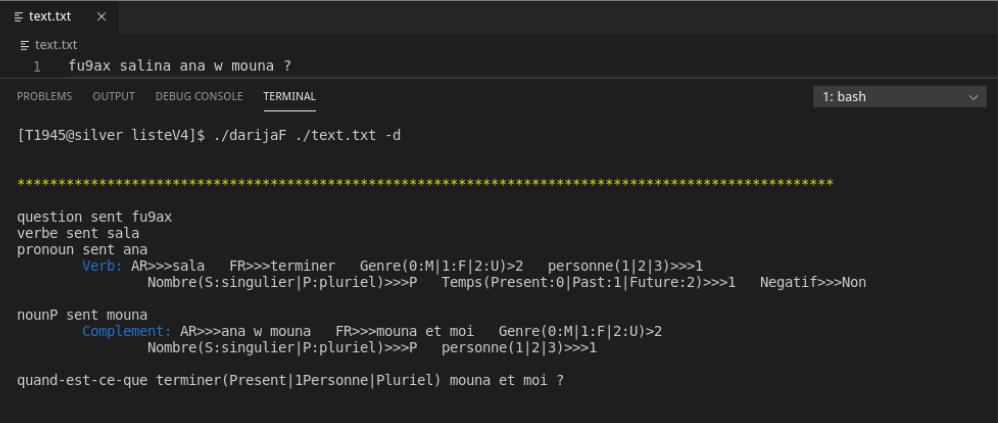
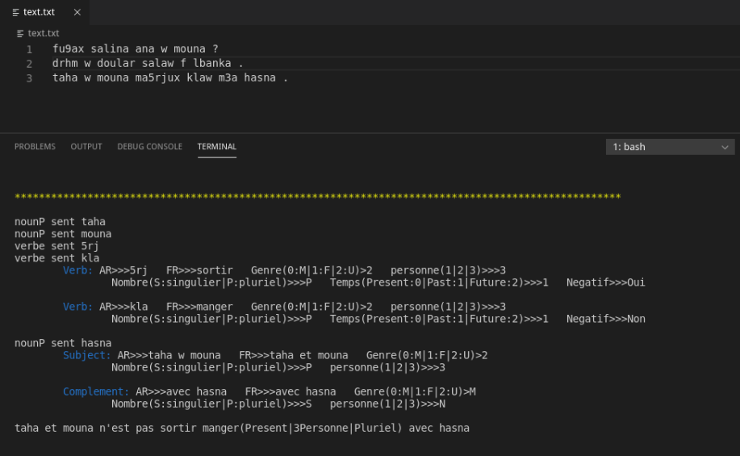
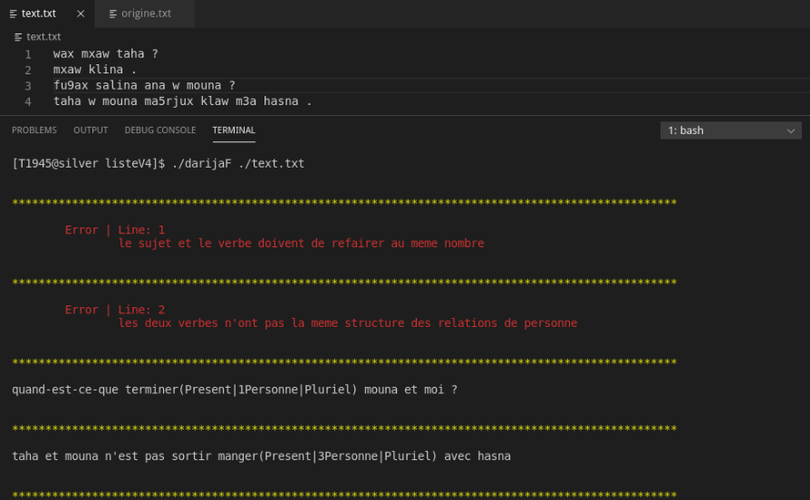

# Description
Command-line grammar checker for Moroccan dialect (darija) and translator to French.

Created using flex and bison: tools developed primarily for context-free language (not natural languages), therefore this is just a proof of concept, a toy-project to practice, and in no case something that you should use as a stand-alone tool.

# Structure of repo
  - presentation.pdf is a presentation (as you have guessed) for the project (we used it as a helper on the D-Day), be aware it's in French.
  - ListeDataStructure contains the code for the list data structure we use.
  - ressources contain helper python scripts and a dictionary folder containing the different classes of words we support. Each entry is of the format "darija_word:frensh_translation"; you don't have to enter all the forms of words, we already take care of that.
  - darijaF/darijaF.exe: the binaries tested on fedora/windows10.
  - text.txt contains the input text that will be analyzed and translated.
  
# Demos

# You want to compile it yourself?
.l and .y files can be compiled with EditPlus on windows and msys64 (version?) and make on Linux (gcc 9).

For windows (for Linux refer to 

`gcc -std=c99 lex.yy.c liste.c words.c y.tab.c -o resultat`

# Contributors
- [EL-HARSAL Mohamed Ali](https://github.com/maeh5)
- GUOURCH Otmane
- [DAHMOU Hicham](https://github.com/Nagisa-sys) (your host)

Special thanks to Professor Aniss Moumen for his valuable advice and teaching.